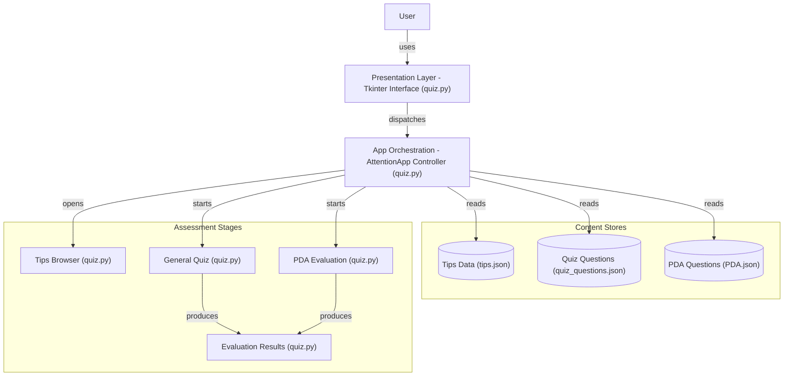

# 💫 About Project:
THIS PROJECT IS MADE FOR PEOPLES WHO ARE WILLING TO MAKE PROGRESS IN THEIR  PERSONALITY-DYNAMICS 

# 🏗️ Architecture:

# 💻 Tech Stack:

### ✍️ Random Dev Quote

---

<!-- Proudly created with GPRM ( https://gprm.itsvg.in ) -->
